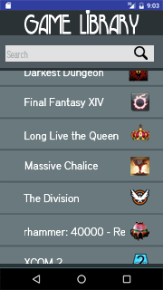
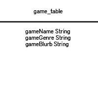

##Mission - Basic
- Data persistance through a SQLite database (CRUD)
- Searching and Filtering
- Testing

- #####Manual Tests
	1. View and scroll game library.
	1. Search using the action bar.
	1. Search for [Name, Genre, Year].
	1. Tap/Click on the library to view more about targeted game.
	1. Tap/Click back to view game library.

##User Stories

##Prototype & ERD

